# DevPoolSoft
Proyecto Final De Henry.

Nos complace presentarles el proyecto DevPool, un desarrollo web que tiene como objetivo crear una plataforma enfocada exclusivamente al ámbito de los desarrolladores y profesionales del mundo de la tecnología.

En DevPool podrán informarse de las ultimas noticias del mundo Tech, ser parte de la comunidad posteando inquietudes o curiosidades que serán respondidas por otros desarrolladores y postularse a ofertas laborales.

Nuestro objetivo con DevPool es crear una comunidad que esté en constante crecimiento de desarrolladores y empresas, donde se promueva el intercambio de conocimientos, la colaboración y la oportunidad de encontrar empleo de manera eficiente.

<h2>
Login --- Register
</h2>

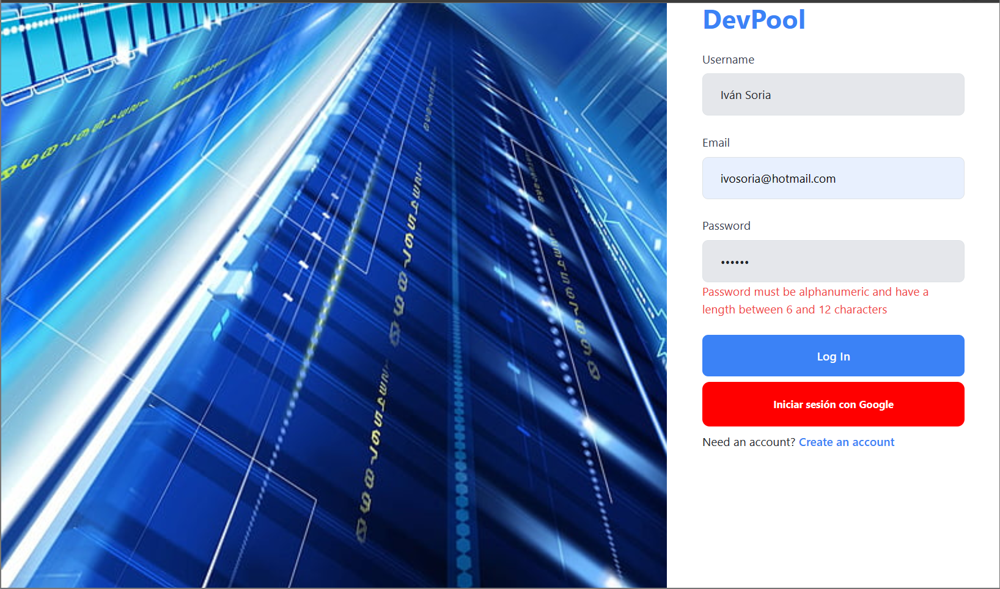

<h2>
Tech News --- Create News
</h2>

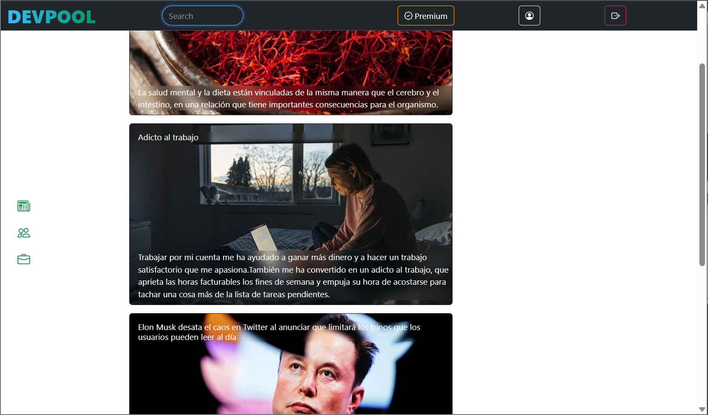
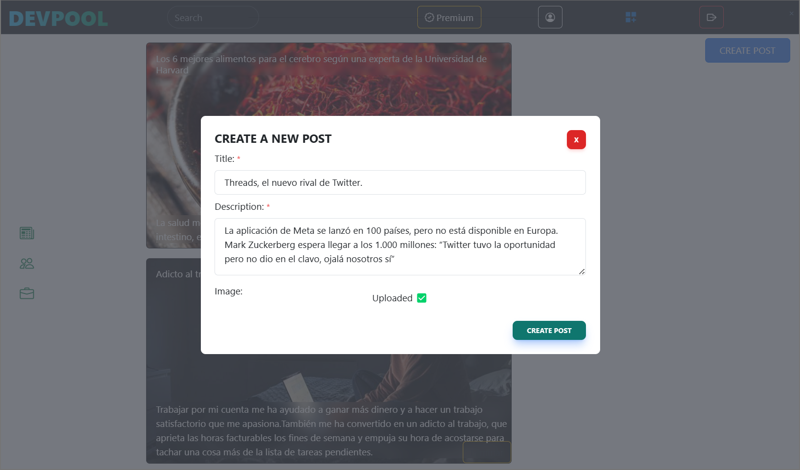  

<h2>
Forum --- Modify or delete post
</h2>

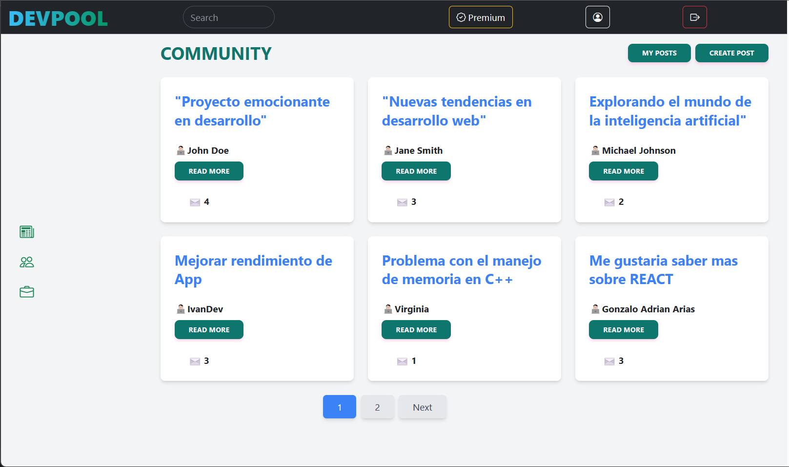
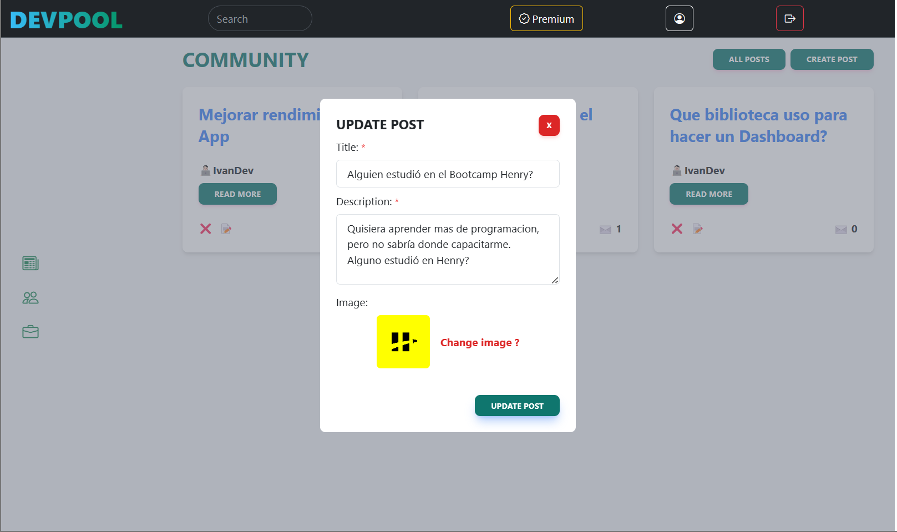

<h2>
Detail post --- Comments
</h2>

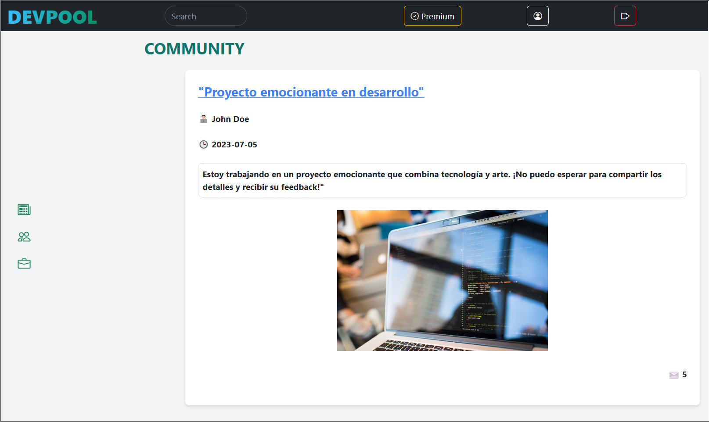
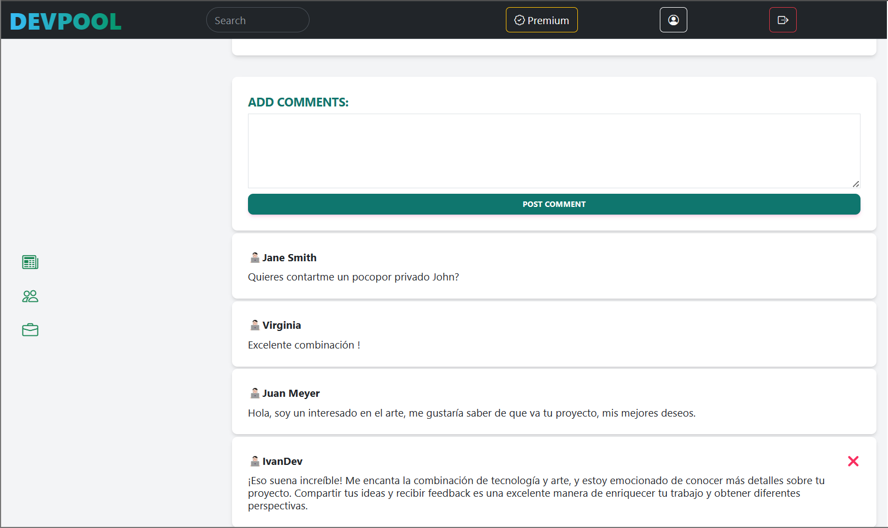

<h2>
Jobs Offers --- Job Application
</h2>

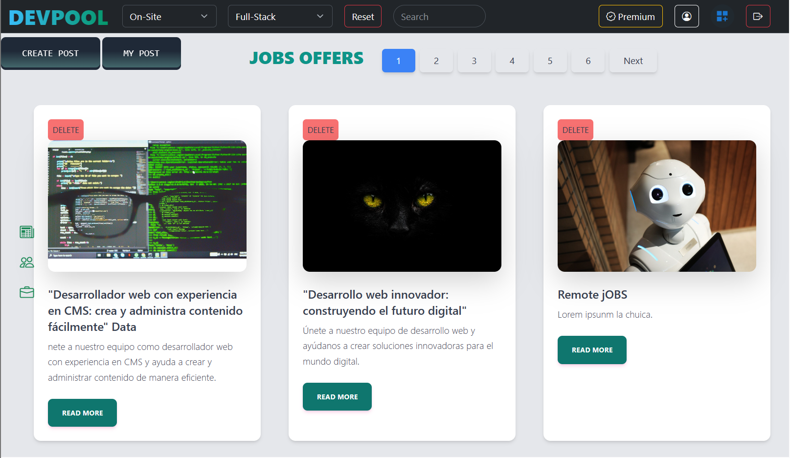
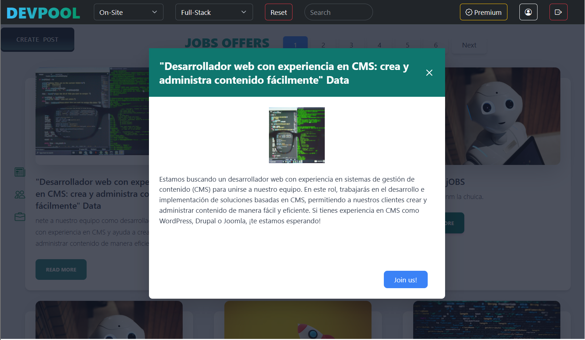

<h2>
Dashboard (dark) --- Change the role
</h2>

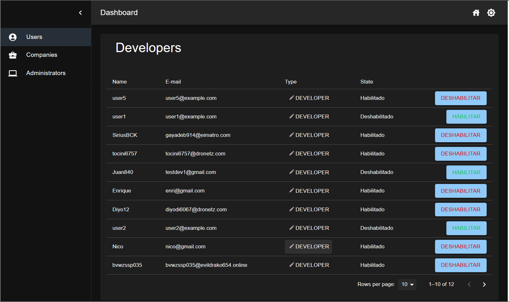
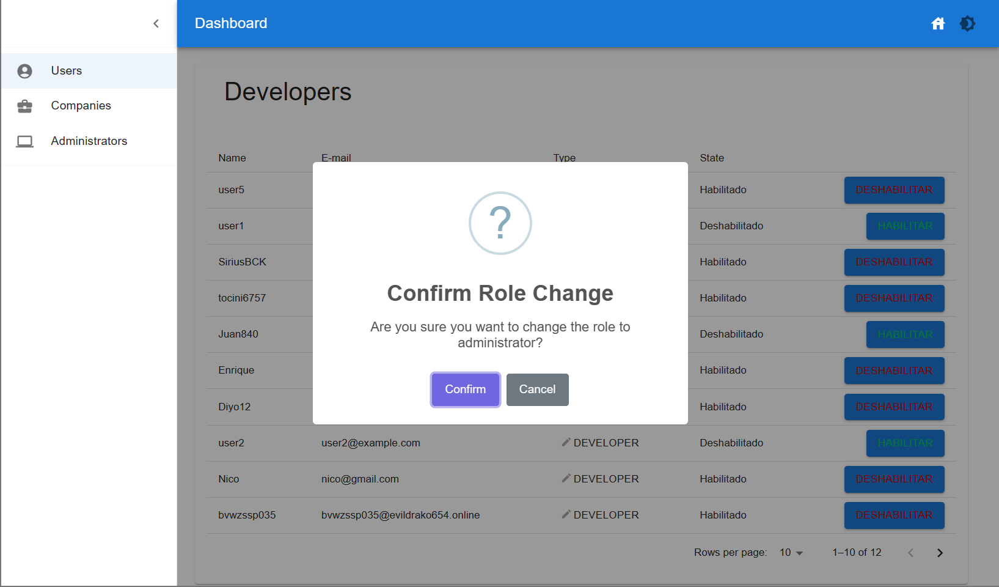

